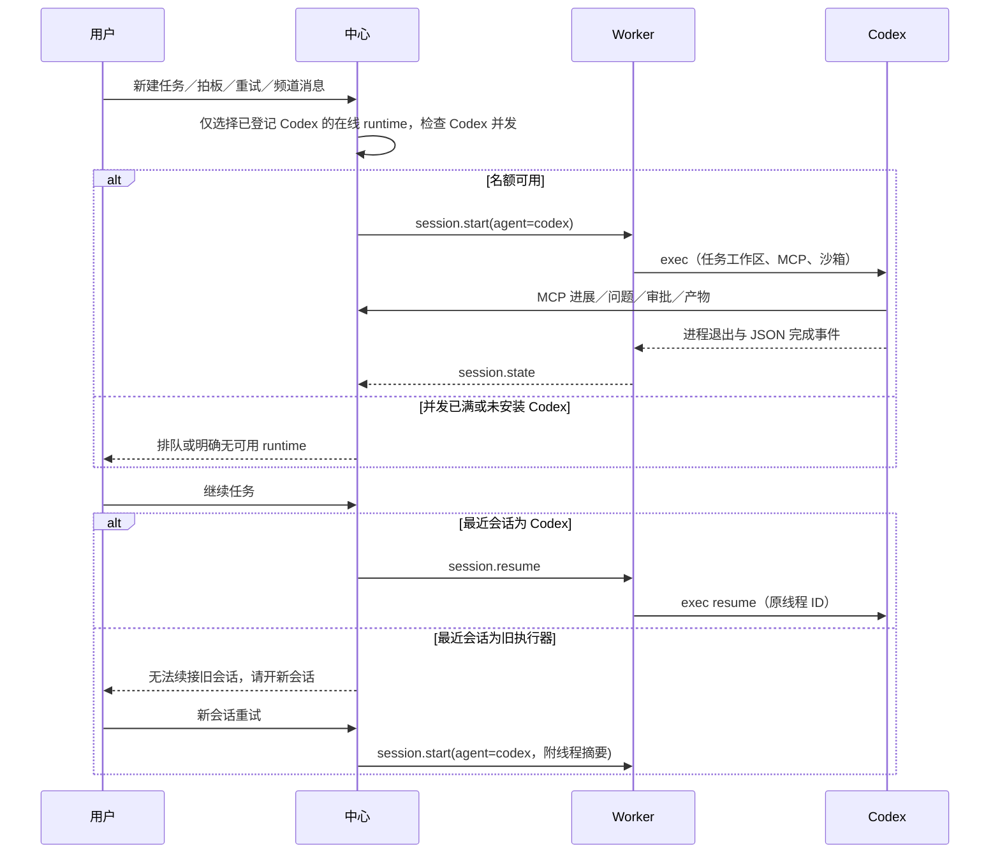

# 变更提案：任务统一由 Codex 执行

> module: core | created: 2026-10-01
> 需求依据：用户要求去掉调用 Claude Code 的代码，全部改用 Codex 执行任务。

## 原因与目标

当前执行链路依赖多执行器轮换、Claude 后台进程轮询和工作区信任文件。统一保留 Codex CLI：代码定位、实现、方案、原型、review、频道调度和候选扫描都通过 `codex exec` 执行；续接通过 `codex exec resume`。继续使用订阅登录态、MCP 审批及现有沙箱设置。

## 设计与场景

## 接口与兼容

- `agent` 新输入只接受 `codex`；worker 注册、配置和能力探测仅保留 Codex。
- 默认 agent、review agent、失败后的自动重试均为 Codex；review 使用独立会话。并发满时排队，不再改派另一家。
- `switch_agent` 重试参数为旧客户端兼容入口，等同开启新的 Codex 会话；面板改用“开新会话继续”。
- 删除 Claude 适配器、信任文件操作和 `.claude/settings.json` hooks 写入。
- 历史数据库记录保留原 agent，旧会话不能冒充 Codex 线程；旧频道调度员由新的 Codex 会话承接。
- 不修改生产数据库或重启服务；交付可测试的仓库改动，后续部署须同时发布中心和所有 worker。

## 实施步骤与验证

1. 增加失败测试，覆盖配置过滤、协议拒绝旧执行器、Codex 默认派发、满额排队、旧会话边界及真实子进程启动／续接／停止。
2. 收敛共享枚举、配置、路由与 worker 适配器；修正 Codex 快速退出时的状态回调时序。
3. 更新面板、部署模板、API 规格和测试 fixture；保留历史设计文档的历史说明。
4. 运行全量单元及 API 编排测试、类型检查、前端和服务构建；检查产物不包含 Claude 调用入口。

新增覆盖：UT-S03-66～UT-S03-76、ST-S03-20～ST-S03-28。沿用共享 OpenLogos reporter。

## 审查补充

- 同一会话的续接／停止按顺序执行；续接前结束原 Codex 进程并等待退出，退出回调按执行轮次隔离，避免旧进程覆盖新轮状态。
- Worker 活跃名额按实际运行会话重算；完成后续接增加名额，重复停止不会减掉其他会话。
- 遗留 planned 会话转换前检查 Codex 名额，满额保留待启动记录；名额释放或 runtime 上线后继续原会话的 kind 和工作区。
- Codex 名额检查和预约在锁定 runtime 行的数据库事务内执行；旧会话转换、新任务、文本会话、代码定位和启动失败重试共用预约逻辑，避免并行派发超额。
- 已结束会话续接前重新预约 Codex 名额；满额返回明确的续接错误，请稍后重试。离线续接已预约的名额保留到 worker 重放指令。
