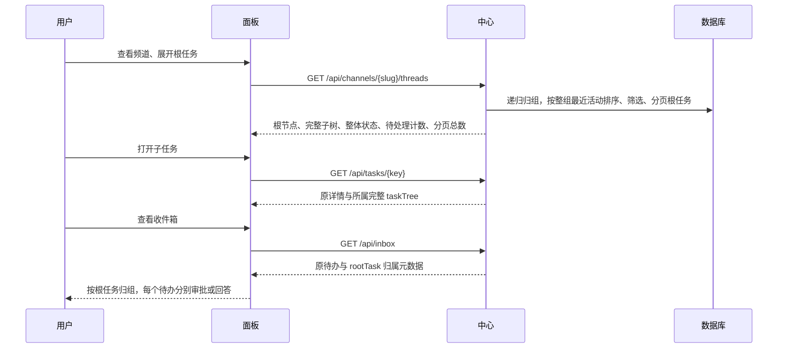

# 变更提案：根任务与后续任务树

> module: core | created: 2026-10-02
> 需求依据：用户确认“一个根任务，一棵任务树”的设计并要求继续实现。

## 原因与目标

后续 PR、审查已有 parent_id，但频道列表与收件箱缺少整体上下文；根任务交付后仍在执行的审查也会被隐藏。沿用现有父子关系，在频道、详情和收件箱统一展示归属与整体进展。

## 场景与接口设计

- 频道线程接口新增 activeOnly 布尔筛选；state 命中任意后代时保留根及完整子树。分页按根任务，子树不截断。返回 total、activeTotal、children，以及 groupState、groupLabel、active、attentionCount、latestActivityAt。
- 详情新增 taskTree（所属根节点的完整树），保留 children 和已有字段兼容旧客户端。子任务可返回父级及根任务，无编号猜测。
- 收件箱的审批、问题、失败项新增 rootTask（key、title、channel、source）；计数仍按事项，候选保持独立。问题补充正确频道与优先级。
- 待处理计数来自开放问题、待审批或可重试失败审批、失败或需要人工处理的任务。整体状态优先等待输入、失败、等待审批，再执行/排队/暂停，最后已完成或已交付；审查执行时显示“审查中”。展示汇总不修改执行状态机。
- 已交付父任务有活动后代或待办时仍属于进行中；整体最近活动取后代与本节点最大时间。子节点按创建时间排序，同时间按任务号自然排序。
- 频道树支持展开折叠、待办路径自动展开、按标题或编号搜索（保留祖先），加载更多根任务。详情展示当前节点高亮、父级导航以及“整体进展/本任务状态”。
- 收件箱按根归组，可折叠；快捷键沿当前可见事项移动，深链定位的待办自动展开，审批仍单项执行。
- 保留既有创建规则：拍板/重试继续本任务，PR/审查仍为原任务后代。没有明确关联证据的旧任务不根据标题或编号猜测父关系；不增加 pick 等新执行能力。
- 用递归查询与批量树组装，避免每个子节点单独查询。不进行数据库迁移或历史数据重写；递归查询防止异常循环。

## 验收与实施

1. 先增加 API 编排失败用例 ST-S03-29～ST-S03-37，覆盖交付父任务下运行中的审查、深层子树、根分页/后代筛选、最近活动排序、收件箱跨层归组、待办解除后的整体状态恢复、累计分页窗口、搜索隔离与已完成节点的待办。
2. 实现查询与归组，再修改频道、详情、收件箱及样式；沿用共享 OpenLogos reporter。
3. 运行全量测试、中心与面板类型检查、构建；用测试数据验证树的展开、导航、筛选及窄屏展示。

## 部署影响

本次需要发布中心和面板，worker 无需更新。当前请求为继续实现；本轮交付仓库改动与验证结果，生产发布另行执行。

## 审查修正

- 搜索时默认展开命中路径，仍允许手动折叠；切换当前节点时展开所属路径，实时更新保留用户选择。
- 收件箱的自动选择与快捷键只针对展开组中的事项，避免选中隐藏待办。
- 新增 throughPage 累计窗口：同一 SQL 决定根顺序与计数，避免实时排序改变后不同分页拼接产生重复或遗漏。
