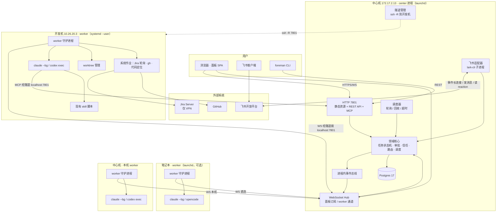

# foreman 技术架构概要

> 2026-10-01 执行器变更：以 `logos/changes/codex-only/proposal.md` 为准，所有定位、实现、review、调度与扫描会话仅使用 Codex。review 使用独立会话；Codex 满额时排队，启动失败用 Codex 新会话重试，旧执行器会话只能查看历史或开新会话。本文原有多执行器轮换、跨执行器 review 与 Claude 专用步骤由此替代。

> 最后更新：2026-09-09
> 模块：core
> 输入：`1-product-requirements/core-01-requirements.md`、`2-product-design/1-feature-specs/core-02/03/04-*.md`
> 范围：M1（S01–S07）为第一版实现范围；架构为 M2、M3 预留扩展点但不实现

## 一、产品全貌提炼

| 维度 | 结论 |
|------|------|
| 场景数量与复杂度 | 12 个场景，M1 实现 7 个。每个场景横跨外部系统、中心、runtime 上的 agent 会话和人工确认，属于**中等复杂度的编排系统** |
| 实时性 | 面板需要 WebSocket 推送（收件箱、线程、runtime 状态）；worker 与中心之间需要长连接 |
| 后台任务 | 来源轮询（Jira 每 5 分钟、GitHub）、飞书事件长连接、会话状态轮询、worktree 回收、调度员会话回收、信任升级计算 |
| 外部依赖 | 飞书（lark-cli 机器人身份）、Jira Server 8.20（REST v2，仅 VPN 可达）、GitHub（gh CLI）、Claude Code CLI、Codex CLI、OpenCode CLI、ssh |
| 用户规模 | 单用户，单实例。runtime 数 ≤ 5，并发会话 ≤ 20，任务量每日数十条 |
| 数据量 | 任务、事件、消息、审批、会话记录，年增量十万行级；日志正文不入库 |
| 关键约束 | 全部走订阅 CLI 不走 API 计费；开发机无法主动连中心；Jira 只能在带 VPN 的 runtime 访问；中心机是 macOS |

## 二、系统架构

### 2.1 架构模式

**模块化单体 + 分布式 worker**：一个中心进程（center）承载全部业务逻辑、API、WebSocket、后台任务和 MCP 服务；每台 runtime 上一个 worker 进程，只做"执行者"：起 agent 会话、管 worktree、跑系统作业。所有状态在中心的 Postgres。

选择这个模式的原因：
- 单用户单实例，没有水平扩展需求，微服务只会增加运维负担。
- 中心必须是唯一写者，才能让审批"先到先得"、信任计数、任务状态机这些一致性要求简单可靠。
- worker 必须分布在各机器上，因为编译、仓库、CLI 登录态都在本机。
- **单端口**：中心所有对外能力（面板静态资源、REST API、WebSocket、MCP）都走 7801 一个端口，这样 `ssh -R` 一条隧道就能让开发机拿到中心的全部能力。

### 2.2 系统架构图

### 2.3 组件职责

| 组件 | 职责 | 不负责 |
|------|------|--------|
| **center / HTTP** | 托管面板静态文件；REST API（面板、CLI 共用）；MCP Streamable HTTP 端点（agent 会话调用） | 业务逻辑（委托领域核心） |
| **center / WebSocket Hub** | 两类连接：面板订阅（推事件）、worker 通道（双向 RPC：下发指令、上报状态、心跳） | 持久化 |
| **center / 领域核心** | 任务树与状态机、上下文包组装、分流、审批（双通道先到先得）、信任升级、路由、agent 选择与轮换、频道与线程、调度员会话生命周期 | 执行任何进程 |
| **center / 事件总线** | 进程内发布订阅；每个领域事件先落库再广播 | 跨进程 |
| **center / 调度器** | 定时触发系统作业（Jira 轮询、GitHub 轮询、会话状态核对、worktree 回收、调度员回收、超时检测） | 执行作业本身（派给 worker） |
| **center / 飞书适配器** | 以机器人身份维持 `lark-cli event +subscribe` 长连接子进程读 NDJSON；发私聊、回复、读 reaction 通过 `lark-cli im` 子命令 | 用户身份操作 |
| **center / 隧道管理** | 为 `transport: reverse-tunnel` 的 runtime 维持 `ssh -R`（autossh 语义，断线重连） | worker 本身 |
| **worker** | 注册与心跳；接收指令：启动/续接/停止会话、查询状态、读日志、创建/回收 worktree、执行系统作业；本地并发闸门；把 agent 输出落到本地文件并按需上传摘要 | 决策（路由、审批、信任） |
| **worker / Agent 适配器** | 统一契约 `start / resume / status / logs / stop`；实现：ClaudeBg、CodexExec、OpenCodeRun | 计费与登录（复用本机登录态） |
| **worker / 系统作业** | 无 LLM 的确定性工作：Jira REST 轮询（带 `vpn:jira` 标签的 runtime）、`gh` 查询、`git merge-tree` 试算、代码定位前的 `rg` 扫描 | 需要判断的工作（交给 agent 会话） |
| **CLI** | `foreman center|worker|runtime|task|approve|reject|inbox`，是 REST API 的薄客户端加本机进程管理 | 业务逻辑 |
| **面板 SPA** | 收件箱、频道/线程、状态、信任、设置；通过 REST 读写、WebSocket 订阅 | 直接访问数据库 |

### 2.4 关键数据流

**S01 Jira 入库**：调度器 → 派"jira-poll"系统作业到带 `vpn:jira` 的 worker → worker 返回增量 issue → 领域核心建任务、组装上下文包 → 派"代码定位"分析会话到开发机 → 会话经 MCP `deliver` 回写定位 → 生成分流卡与审批 → 事件总线 → 面板 WebSocket 推送 + 飞书适配器推私聊。

**S06 双通道审批**：飞书 reaction 事件（NDJSON）→ 飞书适配器 → 领域核心 `approvals.decide(id, via='feishu')`，同一事务内 `UPDATE ... WHERE status='pending'` 保证先到先得 → 事件总线 → 面板卡片变灰、飞书回帖。

**S03/S07 会话生命周期**：领域核心选 runtime 与 agent → 经 worker 通道下发 `session.start{taskId, agent, worktree, contextPack, mcpUrl}` → worker 创建 worktree、写 `.foreman/context.md`、以 `--mcp-config` 指向 `http://127.0.0.1:7801/mcp`（经隧道或直连）启动 `claude --bg` → worker 定期 `claude agents --json` 并接收 Notification 钩子回调 → 上报 `session.state` → 会话内 agent 调用 MCP `report_progress / ask_user / request_approval / deliver` → 领域核心落库并广播 → 用户回复 → `session.resume{sessionId, text}` 下发。

### 2.5 Agent 契约与适配器

| 动作 | ClaudeBg | CodexExec | OpenCodeRun |
|------|----------|-----------|-------------|
| start | `claude --bg --name <T-id> --model <m> --mcp-config <json> "<prompt>"`，解析输出的会话 ID | `codex exec -C <wt> --json -o <outfile> "<prompt>"`，解析 session id | `opencode run --dir <wt> "<prompt>"` |
| resume | `claude --bg --resume <id> "<text>"` | `codex exec resume <id> "<text>"` | `opencode run --session <id> "<text>"` |
| status | `claude agents --json --all` 取 state / waitingFor；Notification 钩子 `agent_completed` / `agent_needs_input` 回调 worker 本地端口 | 进程退出码 + 输出文件解析 | 进程退出码 |
| logs | `claude logs <id>` | 输出文件 | 输出文件 |
| stop | `claude stop <id>` | kill 进程 | kill 进程 |

约束：全部使用本机已登录的订阅身份；**禁止**在任何路径设置 `ANTHROPIC_API_KEY` 或使用 `claude -p`。Notification 钩子通过 worker 写入的项目级 `.claude/settings.json`（worktree 内）注入，只作用于 foreman 创建的 worktree。

### 2.6 MCP 服务

- 端点：`POST /mcp`（Streamable HTTP），无状态会话，鉴权用任务级一次性 token（worker 启动会话时注入到 `--mcp-config` 的 header）。
- 工具：`get_task`、`report_progress`、`ask_user`（长轮询等待，最长 30 分钟，超时返回"用户未回复"）、`request_approval`（同上）、`deliver`、`lookup_jira`、`lookup_pr`、`list_tasks`、`propose_task`、`ask_clarification`。
- `lookup_jira` / `lookup_pr` 由中心转成系统作业派到有能力的 worker 执行，对 agent 透明。

## 三、技术选型

| 维度 | 选型 | 理由 | 备选方案 |
|------|------|------|---------|
| 语言 | TypeScript（Node 24） | 用户日常栈；worker 需调用子进程与文件系统，Node 足够；单一语言降低 monorepo 复杂度 | Go（worker 单二进制分发更省事，但要维护两套类型） |
| 仓库结构 | pnpm workspace + turbo：`apps/center`、`apps/worker`、`apps/cli`、`apps/panel`、`packages/shared`（领域类型、zod schema、协议）、`packages/agent-adapters` | 与 litefuse 同构，用户熟悉 | 单包（后期拆分成本高） |
| 中心 HTTP 框架 | Hono + `@hono/zod-openapi` | 轻量；zod 定义即 OpenAPI，直接服务 OpenLogos 的 API 设计与编排测试；同一进程内可托管静态资源与 MCP | Fastify（生态更大但 OpenAPI 需额外插件）；Next.js API（不适合常驻 WebSocket 与后台任务） |
| API 风格 | REST JSON + OpenAPI 3.1，WebSocket 只做推送与 worker 通道 | 面板与 CLI 共用；可被编排测试直接调用 | tRPC（用户熟悉，但无 OpenAPI，编排测试与 CLI 复用差）。**这是对 Phase 2 默认假设的修改** |
| WebSocket | `ws` 库；消息为 zod 校验的 JSON envelope `{type, id, payload}` | 简单可控 | Socket.IO（多余的抽象） |
| 面板 | Vite + React 19 + TanStack Query + shadcn/ui + Tailwind，构建产物由 center 静态托管 | 单用户无 SSR 需求；单进程单端口便于穿隧道；组件库与用户习惯一致。**这是对 Phase 2 默认假设（Next.js）的修改** | Next.js（多一个进程与端口，SSR 无收益） |
| 数据库 | Postgres 17（中心机已有实例，新建库 `foreman`） | 用户明确要求；事务保证审批先到先得；JSONB 存上下文包与事件 payload | SQLite（用户已否决） |
| ORM 与迁移 | `pg`（node-postgres）直连 + SQL 迁移文件；`schema.sql` 即 0001_init（**实现阶段修订**，原选 Prisma 6） | schema.sql 的 CHECK 约束、部分索引、触发器 Prisma 表达不了，翻译成 schema.prisma 会形成第二份真相；数据访问集中在 domain/*.ts，参数化查询 | Prisma 6（若后续需要类型化查询构建可再评估 Drizzle） |
| 后台调度 | 进程内调度器（`croner`）+ 事件总线（`EventEmitter` 封装，事件先写 `events` 表） | 单进程无需 Redis/BullMQ；重启后从 `jobs` 表恢复 | BullMQ（引入 Redis 依赖，单用户不值得） |
| MCP 服务端 | `@modelcontextprotocol/sdk` Streamable HTTP transport，挂在 Hono 路由下 | 官方 SDK；与 Claude Code / Codex 的 `--mcp-config` 兼容 | 自实现 JSON-RPC（无必要） |
| 飞书 | `lark-cli` 子进程（`event +subscribe` 长连接、`im` 子命令），机器人身份 | 用户已装且已配置应用；事件订阅只支持机器人身份 | 直接调飞书 OpenAPI（要自管 token 与长连接） |
| Jira | REST v2 + PAT Bearer，作为系统作业在带 `vpn:jira` 标签的 worker 上执行 | 中心机不一定能到 VPN；沿用现有 `jira.sh` 的调用方式 | 中心直连（网络不保证） |
| GitHub | `gh` CLI 作为系统作业在带 `gh` 标签的 worker 上执行 | 开发机已登录 airborne12；避免再管 token | GitHub API token（M2 若需 webhook 再引入） |
| 隧道 | `ssh -R 7801:127.0.0.1:7801`，center 内用子进程管理并自动重连（`ServerAliveInterval 15`） | 事实约束：开发机不能外连 | VPN 改造（不在用户控制内） |
| 进程守护 | 中心与本机 worker：launchd；开发机 worker：systemd --user | 各平台原生 | pm2（多一层） |
| 配置与密钥 | `~/.foreman/center.yaml`、`~/.foreman/worker.yaml`；token 与 PAT 通过环境变量或 macOS keychain 注入；`.env` 不入库 | 与现有 skill 的 `~/.jira.conf` 习惯一致 | 中心集中保管密钥（用户否决） |
| 日志 | pino，JSON 行；agent 原始日志留在 worker 本地 `~/.foreman/logs/<session>/`，中心只存摘要与索引 | 日志正文体量大且只在排障时看 | 全量入库（膨胀） |
| 测试 | vitest（单元与场景）；编排测试直接打 REST API；外部依赖用 mock-service | 与 litefuse worker 一致 | Jest |
| 包分发 | `npm i -g @airborne12/foreman`（cli + worker 同包）；center 从仓库运行 | 三台机器都有 Node 24 | 单二进制（`pkg`/bun，后期可加） |

## 四、非功能性约束

- **性能**：REST 读接口 p95 < 200ms（数据量小，主要是 Postgres 本机）；WebSocket 推送延迟 < 1s；从 Jira 分配到分流卡入收件箱 ≤ 10 分钟（含开发机代码定位会话，瓶颈是 agent 而非平台）。
- **一致性**：所有状态变更在 Postgres 事务内完成并写 `events` 表；审批决定用条件更新保证幂等与先到先得；worker 指令带幂等键，重连后重放不重复起会话。
- **可用性**：中心崩溃重启后从 `jobs`、`sessions` 表恢复；worker 断连期间会话继续运行，重连后上报真实状态；worker 离线不改派运行中任务。
- **安全**：单用户；面板与 API 用一个长期 bearer token（首次 `center init` 生成，浏览器存 cookie）；worker 用预共享 token；MCP 用任务级一次性 token；中心只监听 `0.0.0.0:7801` 且建议仅 VPN 网段可达；不集中保管任何第三方凭证；`.foreman/` 目录与 worktree 内的 `.claude/settings.json` 仅注入钩子不注入密钥。
- **额度保护**：每家 agent 每 runtime 并发上限（默认 3）；调度员会话空闲 30 分钟回收；候选扫描每小时一轮；系统作业不使用 LLM。
- **可观测性**：M1 用 pino 日志 + `events` 表 + 面板状态视图；预留 `EventSink` 接口，M2 以后接 OpenTelemetry 到 litefuse。
- **开发体验**：`pnpm dev` 起 center（含面板 HMR 代理）和一个本机 worker；测试用 docker compose 起 Postgres；所有外部依赖有 mock-service 可切换。

## 五、外部依赖与测试策略

| 依赖 | 提供方 | 用于场景 | 测试策略 | 说明 |
|------|--------|---------|---------|------|
| 飞书事件与消息 | lark-cli（机器人身份） | S01、S02、S06、S07 | `mock-service` | 测试时把 `FOREMAN_LARK_CLI` 指向一个假 lark-cli 脚本：`event +subscribe` 从测试目录读 NDJSON 回放，`im` 子命令把发出的消息写入 JSON 文件供断言 |
| Jira Server | SelectDB Jira（PAT，VPN） | S01、S04 | `mock-service` | 本地 fake Jira（Hono 小服务）实现 `search`、`issue`、`comment` 三个端点；测试 worker 的 `JIRA_URL` 指向它 |
| GitHub | gh CLI | S03（创建 PR）、S04（lookup_pr） | `mock-service` | 假 `gh` 脚本按参数返回固定 JSON；M2 再补 PR 事件 |
| Claude Code CLI | claude（订阅） | S03、S04、S07 | `mock-service` | 假 `claude` 脚本模拟 `--bg`（返回 ID）、`agents --json`（按脚本时间线切换 state）、`logs`、`--bg --resume`，并在指定时机调用 MCP 工具 `report_progress / ask_user / deliver`，以验证完整回路 |
| Codex CLI | codex（ChatGPT 订阅） | 同上 | `mock-service` | 假 `codex` 脚本模拟 `exec` / `exec resume` |
| OpenCode CLI | opencode | 契约验证 | `mock-service` | 同上 |
| ssh 反向隧道 | ssh / autossh | S05 | `env-disable` | 测试中 runtime 全部使用 `transport: direct`；隧道管理器单测用假 ssh 命令 |
| 系统时间与定时 | croner | 调度相关 | `fixed-value` | 测试注入可控时钟，手动触发 tick |

## 六、部署约束与交接（供 deployment-designer）

| 项 | 内容 |
|----|------|
| 技术栈 | TypeScript / Node 24 / pnpm 9 / turbo；Hono；Prisma；Postgres 17；Vite + React |
| 部署目标 | 本地开发（笔记本）；**生产 = 中心机 172.17.2.13（macOS，launchd）+ 开发机 10.26.20.3（CentOS 9，systemd --user）+ 笔记本可选**。无测试/预发环境，单用户直接上生产 |
| 运行依赖 | Postgres 17（中心机已有，需建库 `foreman` 与角色）；lark-cli（中心机需安装并以机器人身份登录）；ssh 免密到开发机；开发机与笔记本需 claude / codex / gh / git；出网代理 `http://127.0.0.1:10809`（中心机） |
| 配置与密钥 | `~/.foreman/center.yaml`、`~/.foreman/worker.yaml`；`FOREMAN_TOKEN`（预共享）、`FOREMAN_PANEL_TOKEN`、Jira PAT（复用 `~/.jira.conf`）；均不入库 |
| 数据迁移 | Prisma migrate；无初始化数据；回滚 = 回退版本并 `prisma migrate resolve` |
| 健康检查 | `GET /healthz`（DB、飞书订阅、worker 数）；`foreman center status`；`foreman worker status`；launchd / systemd 状态 |
| smoke 最小链路 | 中心起 → 本机 worker 注册 → `foreman task new --path plan --kind text` → 会话在中心机 runtime 启动并回写进展 → 收件箱出现审批 → `foreman approve` → 任务 delivered。飞书链路 smoke：发一条测试私聊并收到回复 |
| 需要人类确认 | 首次部署时飞书机器人身份登录、开发机 ssh 免密、Postgres 建库 |

建议下一步（Phase 3 顺序）：先 `scenario-architect` 做 S01–S07 时序图，再 `api-designer` 与 `db-designer`，随后 `deployment-designer` 输出部署与 smoke 方案。

## 七、对 Phase 2 假设的修改记录

| Phase 2 假设 | 本文决定 | 原因 |
|-------------|---------|------|
| 面板沿用 Next.js + tRPC | Vite React SPA 由 center 托管；REST + OpenAPI | 单进程单端口穿隧道；OpenLogos 的 API 设计与编排测试需要 OpenAPI；单用户无 SSR 需求 |
| （未定）worker 与中心协议 | WebSocket JSON envelope，worker 拨中心 | 与 Q34 反向隧道方案一致 |
| （未定）后台任务 | 进程内调度器 + `jobs` 表，不引入 Redis | 单进程足够，少一个依赖 |
