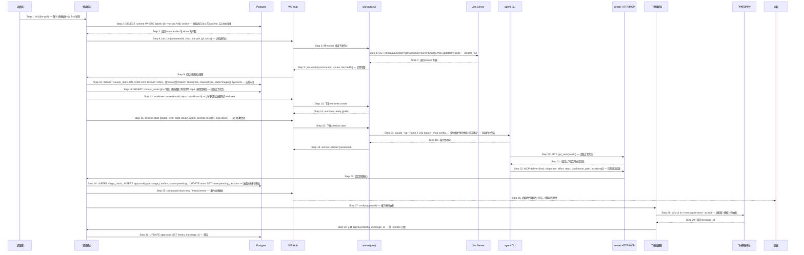

# S01: Jira 单自动入库并生成分流卡 — 时序图

> 来源：Phase 1 S01；Phase 2 `core-02-panel-design.md#S01`、`core-04-conversation-design.md#S01`
> 优先级：P0（M1）
> 触发：调度器定时 tick（默认每 5 分钟），发现 Jira 上 assignee 变为我的 issue

## 参与方

| 别名 | 组件 |
|------|------|
| SCH | center 调度器 |
| CORE | center 领域核心 |
| DB | Postgres |
| HUB | center WebSocket Hub |
| WKD | worker（dev，带 `vpn:jira`、`build:doris` 标签） |
| JIRA | Jira Server（VPN） |
| AG | agent CLI（代码定位会话） |
| API | center HTTP（MCP 端点） |
| FS | center 飞书适配器 |
| FA | 飞书开放平台 |
| P | 面板 SPA |

## 时序图

## 步骤说明

1. **调度器**按 `sources.jira.poll_seconds`（默认 300）触发 `jira-poll` 作业。
2. **领域核心**查询在线且带 `vpn:jira` 标签的 runtime，以及该来源的水位线（上次成功拉取的 `updated` 最大值）。如果没有可用 runtime → 见 EX-2.1。

> Jira 只能经 VPN 访问，中心机不保证可达，所以轮询作为"系统作业"派给 runtime 执行，而不是中心直连。作业不使用 LLM。

3. **Postgres** 返回 runtime 与 `since`。
4. **领域核心**生成带 `commandId` 的 `job.run` 指令。
5. **WS Hub** 经 worker 通道下发。
6. **worker(dev)** 用 `~/.jira.conf` 的 PAT 调 Jira 搜索接口，JQL 固定为 `assignee = currentUser() AND resolution = Unresolved AND updated >= since`。如果 Jira 不可达 → 见 EX-6.1。
7. **Jira** 返回 issue 列表（含 assignee 变更时间、评论、附件元数据）。
8. **worker(dev)** 回传 `job.result`。
9. **WS Hub** 交给领域核心。
10. **领域核心**按 `(source='jira', external_id=issueKey)` 去重写 `source_items`；新 issue 创建根任务，落到 Jira 来源的默认频道，状态 `triaging`。已存在的 issue 若 assignee 由他人改回我 → 见 EX-10.1。
11. **领域核心**组装上下文包：需求原文（summary + description）、Jira 字段（project、component、version、priority）、评论摘要、附件清单、目标仓库（按 `project_repo_map` 映射，标注来源 `mapping`）。映射缺失 → 见 EX-11.1。
12. **领域核心**为代码定位准备 worktree（分析类任务也在开发机跑，因为仓库在那里）。
13. **WS Hub** 下发。
14. **worker(dev)** 以目标仓库默认分支创建 worktree 并回报路径。如果开发机离线 → 见 EX-12.1。
15. **领域核心**派 `code-locate` 会话：路由规则"分析类 → prefer dev"，agent 按轮换选择。
16. **WS Hub** 下发。
17. **worker(dev)** 以 `claude --bg`（或 `codex exec`）启动会话，`--mcp-config` 指向经隧道可达的 `http://127.0.0.1:7801/mcp`，header 带任务级一次性 token。启动失败 → 见 EX-17.1。
18. **agent CLI** 返回会话 ID。
19. **worker(dev)** 回报 `session.started`。
20. **agent** 通过 MCP 读取上下文包。
21. **center HTTP** 返回。
22. **agent** 完成定位后调用 `deliver`，回写档位、工作量、仓库（若上下文包里是待确认，agent 给出候选与置信度）、建议路径与最多 8 条代码位置。会话失败或超时 → 见 EX-22.1。
23. **center HTTP** 交给领域核心。
24. **领域核心**在一个事务内创建分流卡、`triage_confirm` 类型的审批、把任务置为 `pending_decision`，写事件。审批的创建与信任判定逻辑见 S06（`triage_confirm` 也受信任升级，达到阈值后自动按建议执行）。
25. **领域核心**事务提交后广播。
26. **面板**收件箱无刷新插入卡片，左栏计数加一，线程追加事件。
27. **领域核心**请求飞书适配器推送。
28. **飞书适配器**以机器人身份发私聊，正文用"待拍板"模板。发送失败 → 见 EX-28.1。当日推送已超 30 条 → 见 EX-28.2。
29. **飞书**返回 message_id。
30. **飞书适配器**把 message_id 交回领域核心。
31. **领域核心**存到审批记录上，S06 中 reaction 事件靠它匹配审批。

## 异常用例

### EX-2.1: 没有能访问 Jira 的 runtime 在线

- **触发条件**：Step 2 查不到在线且带 `vpn:jira` 的 runtime
- **期望响应**：作业写入 `jobs` 表状态 `queued`，来源健康度 `jira` 标记 `unreachable(no runtime)`，面板状态视图该行标红；不重复排队同类作业
- **副作用**：runtime 上线注册后（S05）调度器立即补跑一次，水位线不变，不丢单

### EX-6.1: Jira 不可达或返回 5xx

- **触发条件**：Step 6 连接超时、TLS 失败或 HTTP ≥ 500
- **期望响应**：`job.result {error: {code: "SOURCE_UNREACHABLE"}}`；领域核心记 `source_health.jira.last_error`，面板标红；下一 tick 重试，连续 3 次失败时推飞书告警一次（之后每小时最多一次）
- **副作用**：水位线不推进

### EX-10.1: 已存在的 issue 被重新分配给我

- **触发条件**：Step 10 中 `source_items` 已有该 issueKey 且对应任务存在
- **期望响应**：不建新任务；在原任务线程追加事件 `source.reassigned`；若任务处于 `paused` 或 `done`，收件箱出现"是否重新打开"条目
- **副作用**：无新审批

### EX-11.1: 无法推断目标仓库

- **触发条件**：Step 11 中 Jira 项目不在 `project_repo_map`，且 issue 正文没有仓库线索
- **期望响应**：上下文包 `repo = null, repo_source = "unresolved"`；流程继续，Step 17 的提示词要求 agent 先猜仓库；Step 24 的分流卡 `repo_status = pending`，面板仓库下拉高亮且"按建议执行"禁用直到选定
- **副作用**：无

### EX-12.1: 开发机离线，无法预跑代码定位

- **触发条件**：Step 12 路由不到在线且带 `build:doris` 的 runtime
- **期望响应**：跳过 Step 12–23，直接执行 Step 24 生成**降级分流卡**（`degraded = true`，无代码定位，档位与工作量由上下文包规则估算），卡片顶部黄条"开发机离线，代码定位待补"；同时把 `code-locate` 作业排队
- **副作用**：开发机上线后补跑 Step 12–23，`deliver` 时更新同一张分流卡（不新建审批），线程追加"代码定位已补齐"

### EX-17.1: 会话启动失败

- **触发条件**：Step 17 `claude --bg` 非零退出或 60 秒内未返回会话 ID
- **期望响应**：worker 回 `session.error {code: "AGENT_START_FAILED", stderr 摘要}`；领域核心按 S03 的换家规则重试一次另一家 agent；仍失败则走 EX-12.1 的降级卡
- **副作用**：worktree 保留供排查

### EX-22.1: 代码定位会话失败或超时

- **触发条件**：Step 22 前会话 state 变为 `failed`，或启动后 15 分钟未 `deliver`
- **期望响应**：领域核心 `session.stop`，生成降级分流卡（同 EX-12.1），卡片标注"代码定位失败：<原因摘要>"
- **副作用**：会话记录保留，线程可展开日志

### EX-28.1: 飞书发送失败

- **触发条件**：Step 28 lark-cli 非零退出或返回错误码（token 失效、机器人未授权）
- **期望响应**：审批照常存在于面板；`notifications` 表记 `failed`，5 分钟后重试最多 3 次；连续失败面板顶部显示"飞书通道异常"
- **副作用**：审批的 `feishu_message_id` 为空，只能在面板处理

### EX-28.2: 当日推送超过上限

- **触发条件**：Step 27 时当日已推送 30 条
- **期望响应**：不立即推送，审批标记 `feishu_deferred`；整点由调度器合并推送"你有 N 项待拍板"一条消息
- **副作用**：合并消息不绑定单个审批，reaction 无效，只能去面板处理
