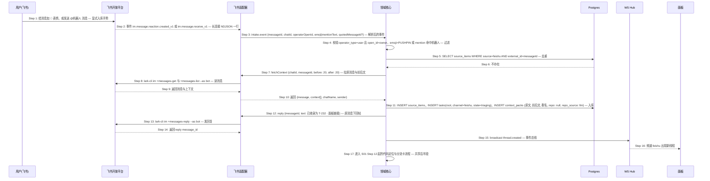
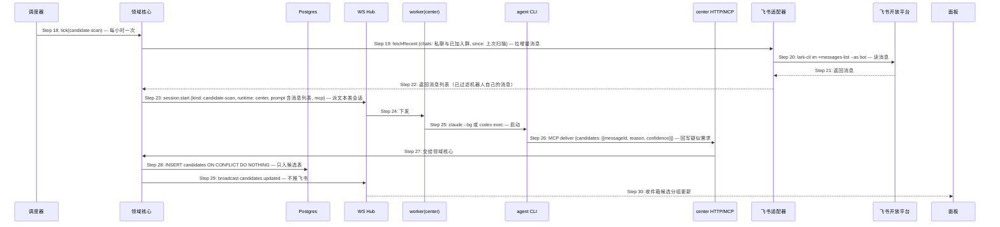

# S02: 飞书消息显式入库 — 时序图

> 来源：Phase 1 S02；Phase 2 `core-04-conversation-design.md#S02`、`core-02-panel-design.md`（S02 面板侧）
> 优先级：P0（M1）
> 触发：我在飞书给某条消息加固定表情 📌，或在群里 @平台机器人

## 参与方

| 别名 | 组件 |
|------|------|
| U | 用户（飞书客户端） |
| FA | 飞书开放平台 |
| FS | center 飞书适配器（`lark-cli event +subscribe` 长连接子进程 + `lark-cli im`） |
| CORE | center 领域核心 |
| DB | Postgres |
| HUB | center WebSocket Hub |
| P | 面板 SPA |
| SCH | center 调度器（候选扫描） |
| WKC | worker（center，跑候选扫描会话） |
| AG | agent CLI |
| API | center HTTP（MCP） |

## 时序图：表情入库主路径

## 时序图：候选扫描（不打扰）

## 步骤说明

### 表情入库主路径

1. **用户**在飞书群或私聊里给一条消息加 📌，或在群里 @机器人（可引用一条消息）。
2. **飞书**通过机器人身份的事件长连接推送事件，飞书适配器以 NDJSON 逐行读取。如果机器人不在该群 → 见 EX-2.1。

> 事件订阅只有机器人身份能用（lark-cli 文档明确），所以适配器常驻的是机器人身份；用户身份只在需要读机器人不在的群时手动刷新使用。

3. **飞书适配器**把原始事件解析为统一的 `intake.event`。
4. **领域核心**校验：只认 `operator_type = user` 且 open_id 等于配置里的 owner；表情必须是配置的入库表情；@ 事件必须命中机器人自身 open_id。不满足 → 见 EX-4.1。
5. **领域核心**按 `(feishu, messageId)` 查重。
6. **Postgres** 返回不存在。已存在 → 见 EX-5.1。
7. **领域核心**请求适配器拉上下文。@机器人且带引用时，以被引用消息为 `messageId`，@ 的那句为补充说明。
8. **飞书适配器**调 lark-cli 读消息与前后各 20 条。
9. **飞书**返回。读取失败 → 见 EX-8.1。
10. **飞书适配器**返回结构化上下文。
11. **领域核心**一个事务内写来源项、根任务（落 `#feishu` 频道，状态 `triaging`）、上下文包。目标仓库此时为空，`repo_source = llm`，由后续代码定位会话给出候选与置信度。
12. **领域核心**请求在原消息下回帖。
13. **飞书适配器**发送回复。
14. **飞书**返回回复 ID。
15. **领域核心**广播线程创建事件。
16. **面板**频道 `#feishu` 出现新线程，首条系统事件含原消息链接与"前后 20 条对话已附加"。
17. **领域核心**从 S01 的 Step 12（创建 worktree、派代码定位会话、生成分流卡、推飞书）继续。S02 与 S01 的差别只在分流卡的仓库字段：agent 猜测置信度 < 0.6 时卡片标"待确认"（同 S01 EX-11.1）。

### 候选扫描

18. **调度器**每小时触发一次候选扫描。
19. **领域核心**请求适配器拉取自上次扫描以来的增量消息（范围：私聊与机器人已加入的群）。
20. **飞书适配器**读取消息。
21. **飞书**返回。
22. **飞书适配器**过滤掉机器人自己发的消息与已入库消息。
23. **领域核心**派一个文本类会话到中心机 runtime（路由规则 `text → prefer center`），提示词包含消息列表与判定标准。没有消息则本轮结束。
24. **WS Hub** 下发。
25. **worker(center)** 启动会话。
26. **agent** 通过 MCP 回写候选列表。
27. **center HTTP** 交给领域核心。
28. **领域核心**写候选表，按 messageId 去重。
29. **领域核心**只广播到面板，**不推飞书**。
30. **面板**收件箱"候选"分组更新，每条只有"入库 / 忽略"两个按钮；"入库"走 Step 5 起的主路径（以候选的 messageId 为入口），"忽略"把候选标记 `dismissed` 且以后不再列出。

## 异常用例

### EX-2.1: 机器人不在群内，收不到事件

- **触发条件**：用户在机器人未加入的群加 📌
- **期望响应**：平台收不到事件，无任何反应；面板设置页"飞书"区块常驻提示"机器人需加入群才能收到表情事件"
- **副作用**：无

### EX-4.1: 非 owner 的表情或 @

- **触发条件**：Step 4 中 operator open_id 不等于 owner，或表情不是配置的入库表情，或 @ 的不是机器人
- **期望响应**：忽略，不回复；`events` 表记一条 `intake.ignored {reason}` 供排查
- **副作用**：无

### EX-5.1: 同一消息重复入库

- **触发条件**：Step 5 查到该 messageId 已有来源项
- **期望响应**：不建任务；在原消息下回帖"已存在 T-100 · 面板链接"
- **副作用**：若原任务 `paused`，线程追加事件"用户再次标记"，收件箱出现"是否恢复"条目

### EX-8.1: 读取消息上下文失败

- **触发条件**：Step 8 lark-cli 返回错误（权限不足、消息已撤回、token 失效）
- **期望响应**：仍然创建任务，上下文包只含事件里能拿到的字段（messageId、chatId、operator），标记 `context_partial = true`；原消息下回帖"已收录为 T-xxx（上下文读取失败，稍后重试）"；调度器 5 分钟后重试补齐，最多 3 次
- **副作用**：分流卡在补齐前以降级形式生成（同 S01 EX-12.1 的处理）

### EX-13.1: 回帖失败

- **触发条件**：Step 13 发送失败
- **期望响应**：任务照常创建；`notifications` 记 `failed` 并重试 3 次；面板线程首条事件标注"飞书回帖未送达"
- **副作用**：无

### EX-23.1: 候选扫描会话不可用

- **触发条件**：Step 23 两家 agent 并发已满或额度耗尽
- **期望响应**：本轮跳过，`jobs` 记 `skipped(quota)`；下一小时再试；不推任何通知
- **副作用**：无

### EX-26.1: 候选扫描会话失败或超时

- **触发条件**：Step 26 前会话失败，或 10 分钟未 `deliver`
- **期望响应**：停止会话，本轮无候选；连续 3 轮失败时面板状态视图标黄
- **副作用**：无
