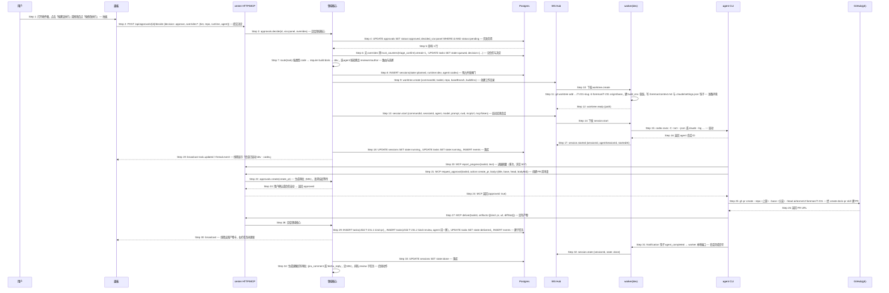

# S03: 拍板分流路径并一键启动 agent — 时序图

> 2026-10-01 执行器变更：以 `logos/changes/codex-only/proposal.md` 为准，所有定位、实现、review、调度与扫描会话仅使用 Codex。review 使用独立会话；Codex 满额时排队，启动失败用 Codex 新会话重试，旧执行器会话只能查看历史或开新会话。本文原有多执行器轮换、跨执行器 review 与 Claude 专用步骤由此替代。

> 来源：Phase 1 S03；Phase 2 `core-02-panel-design.md#S03`（S03.1 拍板、S03.2 启动与产物）、`core-03-runtime-cli-design.md#5.2`（worktree 生命周期）
> 优先级：P0（M1）
> 触发：收件箱里有一张分流卡等待确认

## 参与方

| 别名 | 组件 |
|------|------|
| U | 用户（浏览器） |
| P | 面板 SPA |
| API | center HTTP（REST + MCP） |
| CORE | center 领域核心 |
| DB | Postgres |
| HUB | center WebSocket Hub |
| WKD | worker（dev） |
| AG | agent CLI（实现会话） |
| GH | GitHub（经 gh CLI 与 create-doris-pr skill） |
| FS | center 飞书适配器 |

## 时序图

## 步骤说明

### S03.1 拍板

1. **用户**在收件箱打开分流卡，可修改档位、仓库、runtime、agent，然后点"按建议执行"（未修改）或"按修改执行"（有修改）；快捷键 `a` 等价于前者。飞书 ✅ 走 S06 的飞书通道，效果等价于"按建议执行"。
2. **面板**提交决定与覆盖项。
3. **center HTTP** 交给领域核心。
4. **领域核心**用条件更新抢占审批，保证面板与飞书先到先得。
5. **Postgres** 返回影响行数。为 0 → 见 EX-4.1。
6. **领域核心**：未修改的确认让 `triage_confirm` 的连续计数加一（S06 规则）；修改过的不计数。任务记录最终决定并置为 `queued`。仓库仍为待确认 → 见 EX-6.1。

> 计数只认"原样确认"，因为信任升级的含义是"agent 的建议不需要我改"，改过再确认说明建议还不够好。

### S03.2 启动与产物

7. **领域核心**路由：代码类任务要求 `build:doris` 标签，优先 `dev`；手动覆盖优先。agent 选择按轮换，且本任务后续的 review 子任务必须用另一家。找不到在线 runtime → 见 EX-7.1；该家 agent 并发已满 → 见 EX-7.2。
8. **领域核心**先写一条 `planned` 会话记录，占住该 runtime 上该家 agent 的一个并发名额（并发闸门以 `sessions` 表为准，worker 侧再做一次本地校验）。
9. **领域核心**下发创建 worktree 指令，带目标仓库、基线分支和该分支族的构建环境配置。
10. **WS Hub** 下发。
11. **worker(dev)** 创建 worktree：从 `origin/<base>` 建分支 `foreman/<T-id>`，按 `build_env` 建 thirdparty 与 JDK 软链，写入 `.foreman/context.md`（上下文包 markdown 兜底）与 `.foreman/task.json`，写入项目级 `.claude/settings.json` 注入 Notification 钩子（回调 worker 本地端口）。失败 → 见 EX-11.1。同一任务重试或换家时复用已有 worktree。
12. **worker(dev)** 回报路径。
13. **领域核心**下发会话启动指令：提示词由任务类型模板加上下文包生成，MCP 地址为 `http://127.0.0.1:7801/mcp`（开发机经隧道），header 带任务级一次性 token。
14. **WS Hub** 下发。
15. **worker(dev)** 按适配器启动：Codex 用 `codex exec -C <wt> --json -o <outfile>`，Claude 用 `claude --bg --name <T-id> --mcp-config <json>`。启动失败 → 见 EX-15.1。
16. **agent CLI** 返回会话 ID（Claude 从 `--bg` 输出解析，Codex 从 JSON 事件流解析）。
17. **worker(dev)** 回报 `session.started`。
18. **领域核心**把会话与任务置为 `running`。
19. **面板**线程显示"会话已启动"，右栏会话区块显示 worktree 路径与状态。
20. **agent** 工作过程中多次回写进展摘要（S07）。
21. **agent** 在创建 PR 前调用 `request_approval`，动作类型 `create_pr`，正文含标题、base、head 和 PR 描述。
22. **center HTTP** 让领域核心创建审批（S06 处理双通道与信任），HTTP 请求挂起等待结果，最长 30 分钟。超时 → 见 EX-22.1。
23. **领域核心**在用户确认或信任自动通过后返回。被否决 → 见 EX-23.1。
24. **center HTTP** 把结果返回给 agent。
25. **agent** 用现有 `create-doris-pr` skill 推 fork 并建 PR。失败 → 见 EX-25.1。
26. **GitHub** 返回 PR URL。
27. **agent** 调 `deliver` 回写产物。出方案路径回写 `{kind: doc, path}`，出原型路径回写 `{kind: branch, name, readme}`。
28. **center HTTP** 交给领域核心。
29. **领域核心**创建 PR 子任务与 review 子任务（agent 取另一家），任务置为 `delivered`。
30. **面板**线程出现产物卡；出方案路径的产物卡带"按方案实现"按钮，点击后不再出分流卡，直接以简单修复路径、同一 runtime 创建实现会话，方案全文附加到上下文包。
31. **agent CLI** 会话结束时 Claude Code 的 Notification 钩子（`agent_completed`）回调 worker 本地端口；Codex 由进程退出码判定。
32. **worker(dev)** 上报会话终态。会话失败 → 见 EX-32.1。
33. **领域核心**落库。
34. **领域核心**生成"镜像产物摘要回来源"的审批（Jira 评论或飞书回帖，受信任升级），并按并发情况排队 review 子任务的会话（流程同 Step 7–19，提示词为 review 模板）。

## 异常用例

### EX-4.1: 审批已被另一通道处理

- **触发条件**：Step 4 条件更新影响 0 行（飞书 ✅ 先到，或已否决）
- **期望响应**：HTTP 409 `{ code: "APPROVAL_ALREADY_DECIDED", message: "已在飞书批准", decidedVia, decidedAt }`；面板卡片变灰显示"已在飞书批准 · 12:03"
- **副作用**：无

### EX-6.1: 目标仓库仍为待确认

- **触发条件**：Step 6 时 `repo` 为空且 overrides 未提供
- **期望响应**：HTTP 422 `{ code: "REPO_REQUIRED", message: "请先选择目标仓库" }`；面板不应允许触发（按钮禁用），此为服务端兜底
- **副作用**：Step 4 的更新回滚，审批保持 `pending`

### EX-7.1: 没有满足标签的在线 runtime

- **触发条件**：Step 7 路由结果为空（如 dev 离线）
- **期望响应**：任务状态 `queued`，`queue_reason = "waiting runtime dev"`；线程事件"等待开发机上线"；不会退回笔记本或中心机
- **副作用**：runtime 上线注册（S05）触发重新路由，自动从 Step 8 继续

### EX-7.2: 该家 agent 在该 runtime 并发已满

- **触发条件**：Step 7 选中的 agent 在该 runtime 的 `sessions(state in planned, running)` 数 ≥ 上限（默认 3）
- **期望响应**：任务 `queued`，线程显示队列位置；若任务类型为**分析类**且另一家有空位，改派另一家并在线程说明"已改派 claude（codex 满）"；代码与 review 类不换家
- **副作用**：任一会话结束触发队列重排

### EX-11.1: worktree 创建失败

- **触发条件**：Step 11 `git worktree add` 失败（分支已存在、磁盘不足、origin 未 fetch）
- **期望响应**：worker 回 `error {code: "WORKTREE_FAILED", detail}`；领域核心先尝试 `git fetch` 后重试一次；仍失败则任务 `failed`，收件箱失败卡"重试 / 放弃"
- **副作用**：磁盘不足时同时触发 gc（S05 EX 见 worktree 回收）

### EX-15.1: agent 启动失败

- **触发条件**：Step 15 非零退出或 60 秒内无会话 ID
- **期望响应**：worker 回 `session.error`；领域核心释放并发名额，自动换另一家重试一次（复用 worktree）；仍失败则任务 `failed`，失败卡三选一
- **副作用**：两次失败的 stderr 摘要写入线程

### EX-22.1: 审批等待超时

- **触发条件**：Step 22 挂起 30 分钟无人处理
- **期望响应**：MCP 返回 `{approved: false, reason: "timeout"}`；agent 应停止并 `report_progress("等待创建 PR 的确认")` 后结束会话；审批保留在收件箱，用户确认后领域核心以 `session.resume` 把"已批准，继续创建 PR"送回会话
- **副作用**：任务状态 `waiting_approval`

### EX-23.1: 审批被否决

- **触发条件**：Step 23 用户在面板或飞书否决
- **期望响应**：MCP 返回 `{approved: false, reason: "rejected", comment}`；agent 按否决意见调整后可再次申请，或结束会话；该动作类型信任计数清零（S06）
- **副作用**：线程记录否决原因

### EX-25.1: 创建 PR 失败

- **触发条件**：Step 25 `gh pr create` 失败（未登录、push 被拒、模板校验失败）
- **期望响应**：agent 调 `report_progress` 说明原因并 `deliver({kind: branch})` 只交付分支；领域核心生成失败卡"重试创建 PR"，任务停在 `running`
- **副作用**：分支已推送到 fork 的情况在线程注明

### EX-32.1: 会话以失败结束

- **触发条件**：Step 32 上报 `state = failed`（Claude `agents --json` 为 failed，或 Codex 非零退出）且无 `deliver`
- **期望响应**：任务 `failed`；收件箱失败卡：`重试`（同 agent、同 worktree）、`换 agent`（另一家、同 worktree）、`放弃`（任务 `paused`）；线程附失败原因摘要与日志入口
- **副作用**：worktree 保留；并发名额释放

### EX-34.1: 镜像回写失败

- **触发条件**：Step 34 的 Jira 评论或飞书回帖执行失败（Jira 不可达、消息已撤回）
- **期望响应**：审批状态 `failed`，线程事件"回写失败：<原因>"，收件箱出现"重试回写"条目；任务状态不受影响
- **副作用**：无
