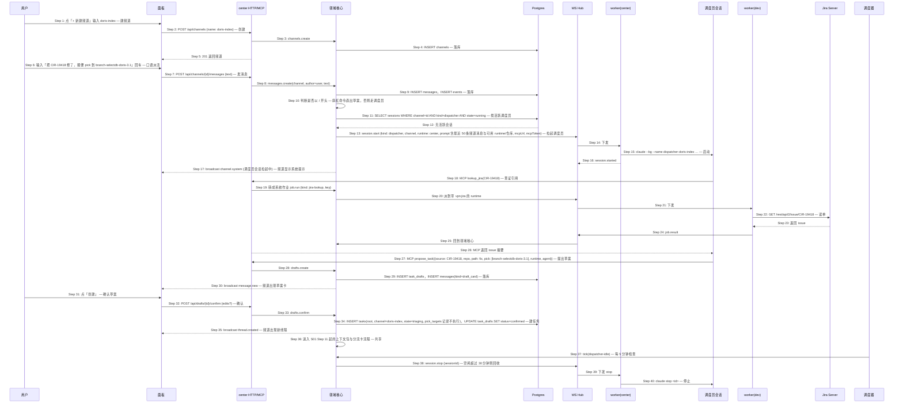

# S04: 在 IM 频道用口语派活 — 时序图

> 来源：Phase 1 S04；Phase 2 `core-02-panel-design.md#S04`、`core-04-conversation-design.md#S04`、`core-03-runtime-cli-design.md#5.1`（斜杠命令等价表）
> 优先级：P0（M1）
> 触发：我在自建频道里输入一句话

## 参与方

| 别名 | 组件 |
|------|------|
| U | 用户（浏览器） |
| P | 面板 SPA |
| API | center HTTP（REST + MCP） |
| CORE | center 领域核心 |
| DB | Postgres |
| HUB | center WebSocket Hub |
| WKC | worker（center，跑调度员会话） |
| AG | agent CLI（调度员会话） |
| WKD | worker（dev，执行 lookup_jira 系统作业） |
| JIRA | Jira Server |
| SCH | center 调度器（空闲回收） |

## 时序图

## 步骤说明

1. **用户**新建频道，名称小写加连字符。
2. **面板**调用创建接口。
3. **center HTTP** 交给领域核心。
4. **领域核心**写入频道。重名 → 见 EX-4.1。
5. **面板**进入空频道，顶部提示"用一句话派活，或输入 / 查看命令"。
6. **用户**输入口语并回车。
7. **面板**发送消息。
8. **center HTTP** 交给领域核心。
9. **领域核心**先把用户消息落库并广播，保证不论后面调度员是否可用，消息不丢。
10. **领域核心**判断消息是否斜杠命令。是 → 见 EX-10.1（直出草案，跳过 Step 11–26）。
11. **领域核心**查该频道是否已有运行中的调度员会话。
12. **Postgres** 返回无。
13. **领域核心**拉起调度员：路由到中心机 runtime（文本类），提示词包含频道名、最近 50 条消息、在线 runtime 与标签、已登记仓库、可用 MCP 工具说明。两家额度都不可用 → 见 EX-13.1。若已有活跃会话，则改为 `session.resume` 把新消息追加进去。
14. **WS Hub** 下发。
15. **worker(center)** 启动会话。
16. **worker(center)** 回报。
17. **面板**频道出现"调度员会话拉起中"系统提示。
18. **调度员**必须先查证引用的 Jira 单或 PR。

> 行为规范：引用查不到就澄清，不猜；只提草案不建任务；一句话多个需求拆多张草案。

19. **center HTTP** 把 `lookup_jira` 转成系统作业，对 agent 透明。
20. **领域核心**派到带 `vpn:jira` 的 runtime。没有 → 见 EX-20.1。
21. **WS Hub** 下发。
22. **worker(dev)** 读 issue。
23. **Jira** 返回。查不到 → 见 EX-22.1。
24. **worker(dev)** 回传。
25. **WS Hub** 回到领域核心。
26. **center HTTP** 把 issue 摘要作为 MCP 结果返回给调度员（整个往返在 MCP 请求内挂起，最长 60 秒）。
27. **调度员**调用 `propose_task`，一次调用一张草案；多任务 → 见 EX-27.1；语义不明 → 见 EX-27.2。
28. **center HTTP** 交给领域核心。
29. **领域核心**写草案与草案卡消息。pick 目标在 M1 只记录进字段。
30. **面板**频道出现草案卡，字段可修改。30 秒内未出现 → 见 EX-30.1。
31. **用户**点"创建"（或"修改"后创建，或"取消"）。
32. **面板**提交确认与修改项。
33. **center HTTP** 交给领域核心。
34. **领域核心**创建根任务并挂到该频道，草案标记已确认。草案已被取消或过期 → 见 EX-34.1。
35. **面板**频道出现新线程入口。
36. **领域核心**从 S01 的 Step 11 继续（组装上下文包、代码定位、分流卡）。
37. **调度器**每 5 分钟检查各频道调度员会话的最后活动时间。
38. **领域核心**对空闲超过 30 分钟的会话下发停止。
39. **WS Hub** 下发。
40. **worker(center)** 停止会话；下次频道有输入时重新拉起（Step 13），用频道历史重建上下文。

## 异常用例

### EX-4.1: 频道重名

- **触发条件**：Step 4 唯一约束冲突
- **期望响应**：HTTP 409 `{ code: "CHANNEL_EXISTS", message: "频道已存在" }`
- **副作用**：无

### EX-10.1: 斜杠命令直出草案

- **触发条件**：Step 10 消息以 `/task new` 等命令开头
- **期望响应**：领域核心用命令解析器（不经 LLM）生成草案并写草案卡，缺参数时草案字段留空并高亮；`/task pause|resume`、`/approve`、`/runtime` 直接执行对应 REST 语义并回系统消息；未知命令回"未知命令，输入 / 查看列表"
- **副作用**：跳过 Step 11–26，从 Step 29 继续

### EX-13.1: 调度员不可用

- **触发条件**：Step 13 两家 agent 在中心机 runtime 并发已满或额度耗尽，或中心机 worker 离线
- **期望响应**：频道出现系统提示"调度员不可用（原因），可用 /task new …"，附一条预填命令；用户消息保留；额度恢复后**不自动重放**
- **副作用**：`jobs` 记录 `skipped`

### EX-20.1: 没有能访问 Jira 的 runtime

- **触发条件**：Step 20 路由为空
- **期望响应**：MCP `lookup_jira` 返回 `{error: "SOURCE_UNAVAILABLE"}`；调度员按规范调用 `ask_clarification("暂时查不到 Jira，请确认 CIR-19418 的标题与仓库")`，草案字段由用户补
- **副作用**：无

### EX-22.1: 引用不存在

- **触发条件**：Step 22 Jira 返回 404
- **期望响应**：MCP 返回 `{found: false}`；调度员调用 `ask_clarification(text, candidates)`，候选来自 `list_tasks({recent: 5})` 与最近分配给我的单；频道出现澄清气泡与候选按钮，不出草案卡
- **副作用**：用户点候选后作为新消息进入 Step 7，调度员再提草案

### EX-27.1: 一句话对应多个任务

- **触发条件**：Step 27 调度员识别出多个独立需求
- **期望响应**：多次调用 `propose_task`，频道并排出现多张草案卡，各自独立确认
- **副作用**：无

### EX-27.2: 语义不明确

- **触发条件**：调度员无法确定需求对象（如"看看那个索引的问题"）
- **期望响应**：调用 `ask_clarification`，最多一轮；用户回答后必须给草案或明确说无法处理
- **副作用**：无

### EX-30.1: 调度员超时

- **触发条件**：Step 13 启动后 60 秒内既无 `propose_task` 也无 `ask_clarification`
- **期望响应**：频道系统提示"调度员响应超时，可用 /task new …"；会话继续运行，若稍后回写则正常展示
- **副作用**：无

### EX-34.1: 草案已取消或过期

- **触发条件**：Step 34 草案状态非 `open`（用户已取消，或超过 24 小时）
- **期望响应**：HTTP 409 `{ code: "DRAFT_NOT_OPEN" }`；面板提示重新派活
- **副作用**：无
