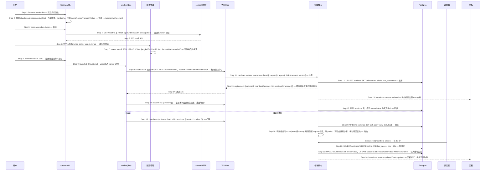

# S05: 接入一台 runtime 并让任务路由到它 — 时序图

> 来源：Phase 1 S05；Phase 2 `core-03-runtime-cli-design.md#S05`（S05.1 首次接入、S05.2 反向隧道、S05.3 路由与离线）
> 优先级：P0（M1）
> 触发：我在一台机器上安装 worker，或已有机器重启

## 参与方

| 别名 | 组件 |
|------|------|
| U | 用户（终端） |
| CLI | foreman CLI |
| WK | worker 守护进程（本场景以开发机 dev 为例） |
| TUN | center 隧道管理（ssh -R 子进程） |
| API | center HTTP |
| HUB | center WebSocket Hub |
| CORE | center 领域核心 |
| DB | Postgres |
| SCH | center 调度器 |
| P | 面板 SPA |

## 时序图

## 步骤说明

### S05.1 首次接入

1. **用户**在机器上运行初始化。
2. **CLI** 探测本机能力（各 agent 二进制与登录态、gh、git、已知仓库路径、thirdparty 是否存在），据此生成默认标签；问答收集 runtime 名、中心地址、传输方式、预共享 token（写入 keychain 或环境变量引用），写 `~/.foreman/worker.yaml`。探测到的 codex 不可用 → 不打 `agent:codex` 标签并给警告。
3. **用户**运行自检。
4. **CLI** 检查中心连通性并校验 token（只校验不注册）。
5. **center HTTP** 返回。401 → 见 EX-5.1；不可达 → 见 EX-5.2。

### S05.2 反向隧道（开发机）

6. **用户**在中心机运行隧道命令（笔记本直连场景跳过 Step 6–7）。
7. **隧道管理**按 `center.yaml` 的 `tunnels.dev` 拉起 `ssh -R`，映射中心的 7801 到开发机的 `127.0.0.1:7801`，纳入 launchd 常驻，断线自动重连。ssh 失败 → 见 EX-7.1。

> 开发机上 172.17/16 被 docker0 占用且无 VPN，无法主动连中心；反向隧道让 worker 协议保持"拨中心"不变，只有传输层不同。

8. **用户**启动 worker。
9. **CLI** 注册为常驻服务（开发机 systemd --user，Mac launchd）并启动进程。
10. **worker** 用 token 连接中心的 worker 通道；开发机的地址是隧道的本地端口。token 错误 → 见 EX-10.1。
11. **WS Hub** 把注册消息交给领域核心。
12. **领域核心**写入或更新 runtime 记录。名称与已在线的另一连接冲突 → 见 EX-12.1。
13. **领域核心**返回 ack，附离线期间为它排队的指令（如 S01 EX-2.1 的作业、S03 EX-7.1 的任务）。
14. **WS Hub** 送达。
15. **面板**状态视图出现该 runtime 与标签。
16. **worker** 上报本机会话真实状态（用 `claude agents --json --all` 与 Codex 进程表）。
17. **领域核心**对账，把此前标为失联的会话修正为真实状态；本机已不存在的会话标 `lost`。

### S05.3 路由与离线

18. **worker** 每 30 秒心跳，带负载、磁盘、各家 agent 运行中会话数。
19. **领域核心**刷新。磁盘超过 85% → 见 EX-19.1。
20. **领域核心**路由：`routing` 中该任务类型的 `require` 标签必须全部命中；多个候选取 `prefer`，再取运行中会话最少者；用户手动覆盖优先于规则；线程记录路由依据。
21. **调度器**每 30 秒检查心跳。
22. **领域核心**找出超过 90 秒（3 次心跳）无心跳的在线 runtime。
23. **领域核心**标离线，其上运行中会话标失联，**不改派**运行中任务；排队中且只能在该 runtime 跑的任务保持排队。
24. **面板**标红并显示"最近心跳 1m32s 前"；连续 5 分钟离线推飞书告警一次（S06 之外的通知，不需审批）。

## 异常用例

### EX-5.1: token 错误

- **触发条件**：Step 4 的 auth-check 返回 401
- **期望响应**：doctor 输出红项"token 无效"，退出码 1；不写任何状态
- **副作用**：无

### EX-5.2: 中心不可达

- **触发条件**：Step 4 连接超时
- **期望响应**：doctor 输出红项"中心连通失败"，并按 transport 提示：direct 提示检查网络，reverse-tunnel 提示先在中心机 `foreman center tunnel <name> up`
- **副作用**：无

### EX-7.1: 隧道建立失败或断开

- **触发条件**：Step 7 ssh 退出（免密未配置、网络中断）
- **期望响应**：隧道管理按 5s、10s、30s 退避重连，`tunnel status` 显示 `reconnects` 与最近失败原因；免密未配置这类非临时错误直接报错不重试；隧道断开期间 worker 心跳丢失走 Step 21–24
- **副作用**：5 分钟内无法重建则推飞书告警

### EX-10.1: worker 注册被拒

- **触发条件**：Step 10 token 错误或版本不兼容
- **期望响应**：中心返回 `{type: "error", code: "AUTH_INVALID"|"VERSION_UNSUPPORTED"}` 并关闭连接；worker 本地日志明确错误，按 60s、120s、300s 退避重试，前台模式打印下次重试时间；`worker status` 显示 `auth_failed`
- **副作用**：中心记录来源 IP 与失败次数

### EX-12.1: runtime 名冲突

- **触发条件**：Step 12 同名 runtime 已有活跃连接（另一台机器用了同名）
- **期望响应**：拒绝新连接 `{code: "RUNTIME_NAME_CONFLICT"}`，提示改名；同一台机器重连（旧连接已断或 `instanceId` 相同）则替换旧连接
- **副作用**：无

### EX-19.1: 磁盘高水位

- **触发条件**：Step 19 心跳报告磁盘使用率 ≥ 85%
- **期望响应**：领域核心下发 `worktree.gc {policy: high-watermark}`；worker 从最老的终态 worktree 删起直到低于水位，运行中任务的 worktree 永不删；每次删除写对应任务线程事件；面板 runtime 行标黄并显示可回收数
- **副作用**：终态不满 3 天的 worktree 也可能被删（高水位优先）

### EX-23.1: worker 离线期间任务需要它

- **触发条件**：Step 23 标离线后有新任务路由要求该 runtime，或用户在其上的会话追加消息
- **期望响应**：任务 `queued` 并注明等待原因；追加的消息排队标记"等待上线后送入"（S07 EX-5.1）；上线后 Step 13 的 `pendingCommands` 一次性补发
- **副作用**：无
