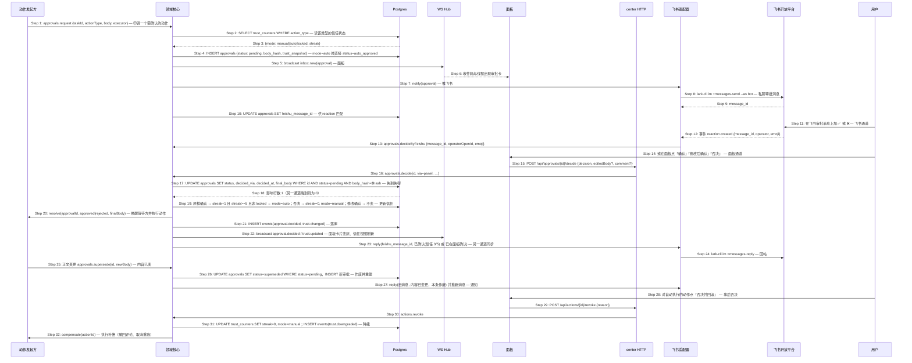

# S06: 审批双通道与信任升级 — 时序图

> 来源：Phase 1 S06；Phase 2 `core-02-panel-design.md#S06`（S06.1 审批卡、S06.2 信任视图）、`core-04-conversation-design.md#S06`（飞书表情审批）
> 优先级：P0（M1）
> 触发：平台产生一条需要人确认的动作
> 本场景是横切场景：S01 的分流卡确认、S03 的创建 PR 与镜像回写、S07 的回复等都通过本流程。

## 参与方

| 别名 | 组件 |
|------|------|
| SRC | 动作发起方（领域核心内部逻辑，或 MCP `request_approval` 的调用） |
| CORE | center 领域核心 |
| DB | Postgres |
| HUB | center WebSocket Hub |
| P | 面板 SPA |
| API | center HTTP |
| FS | center 飞书适配器 |
| FA | 飞书开放平台 |
| U | 用户（浏览器或飞书） |

## 时序图

## 步骤说明

1. **动作发起方**申请审批：领域核心内部（分流卡就绪、镜像回写）或 agent 会话经 MCP `request_approval`。带动作类型、正文、执行器（决定通过后由谁执行）。
2. **领域核心**读该动作类型的信任状态。
3. **Postgres** 返回模式与连续原样确认数。
4. **领域核心**创建审批记录，存正文哈希与信任快照。若模式为 `auto` → 见 EX-4.1（不生成待办，直接执行）；`locked` 永远 `manual`。

> 信任按"动作类型"计数，不乘以仓库或 agent，避免组合爆炸（Q12 决策）。`merge_release` 与 `jira_done` 是锁定类型，M2 才会出现。

5. **领域核心**广播到面板。
6. **面板**收件箱与对应线程出现同一张审批卡。
7. **领域核心**请求推飞书。发送失败或当日超限 → 同 S01 EX-28.1 / EX-28.2。
8. **飞书适配器**发送审批消息（模板见 Phase 2 core-04）。
9. **飞书**返回 message_id。
10. **领域核心**记录 message_id。
11. **用户**在飞书加 ✅ 或 ❌。非 owner 的表情 → 见 EX-12.1；对已作废消息 → 见 EX-12.2。
12. **飞书**推 reaction 事件。
13. **飞书适配器**按 message_id 找审批并交给领域核心（✅ 映射 approve，❌ 映射 reject，其他表情忽略）。
14. **用户**或者在面板操作。"修改后确认"时提交编辑后的正文。
15. **面板**提交决定。
16. **center HTTP** 交给领域核心。
17. **领域核心**条件更新：同时要求 `status = pending` 与 `body_hash` 一致（防止批的是旧正文）。
18. **Postgres** 返回影响行数。为 0 → 见 EX-18.1。
19. **领域核心**更新信任：原样确认（未改正文）连续计数加一，达到阈值（默认 5）且非锁定则升级为自动；否决清零并回人工；修改后确认不改变计数。
20. **领域核心**唤醒等待方：MCP 请求返回结果给 agent，或内部执行器执行动作（发 Jira 评论、飞书回帖等）。执行失败 → 见 EX-20.1。
21. **领域核心**写事件。
22. **面板**卡片变灰显示"已确认 · 面板 / 已在飞书批准 · 12:03"，信任视图刷新，达到阈值的行高亮。
23. **领域核心**在飞书消息下回帖同步结果（含信任计数），面板先处理时回"已在面板确认"。
24. **飞书适配器**发送。
25. **动作发起方**在审批待决期间修改了正文（agent 重新生成回复草稿）。
26. **领域核心**作废旧审批，创建新审批（回到 Step 4）。
27. **领域核心**在旧消息下回"本条作废"，并推新消息。
28. **用户**对一条自动执行的动作（Step 4 的 EX-4.1 路径）在线程点"否决并回滚"，7 天内有效。
29. **面板**提交。
30. **center HTTP** 交给领域核心。
31. **领域核心**把该动作类型降级为人工并清零，写降级事件。
32. **领域核心**执行补偿：可撤回的动作撤回（删除 Jira 评论、撤回飞书消息、取消未开始的 CI 重跑），不可撤回的只记录并提示。补偿失败 → 见 EX-32.1。

## 异常用例

### EX-4.1: 动作类型已升级为自动

- **触发条件**：Step 3 返回 `mode = auto`
- **期望响应**：审批记录 `status = auto_approved`，不进收件箱、不推飞书；直接执行 Step 20；线程事件"自动执行（<类型>，信任 5/5）"并带"否决并回滚"入口
- **副作用**：`actions` 表记录可回滚信息与 7 天有效期

### EX-12.1: 非 owner 的表情

- **触发条件**：Step 12 事件的 operator 不是配置的 owner open_id，或 `operator_type` 不是 user（机器人自己的表情）
- **期望响应**：忽略；`events` 记 `approval.reaction_ignored`
- **副作用**：无

### EX-12.2: 对已作废或已决定消息的表情

- **触发条件**：Step 12 的 message_id 对应审批状态非 `pending`
- **期望响应**：飞书回帖"本条已作废，请对新消息操作"或"A-88 已于 12:03 确认，如需撤销请到面板"；不执行
- **副作用**：无

### EX-18.1: 另一通道先到

- **触发条件**：Step 17 影响 0 行
- **期望响应**：面板通道返回 HTTP 409 `{ code: "APPROVAL_ALREADY_DECIDED", decidedVia, decidedAt }`；飞书通道回帖"已于 hh:mm 在面板确认，本次操作忽略"；两个通道 5 秒内状态一致
- **副作用**：无

### EX-18.2: 正文哈希不一致

- **触发条件**：Step 17 因 `body_hash` 不匹配影响 0 行（用户批的是变更前的正文）
- **期望响应**：HTTP 409 `{ code: "APPROVAL_BODY_CHANGED" }`；面板卡片顶部红条"内容已变更，原审批作废"，下方出现新审批
- **副作用**：无

### EX-19.1: 锁定类型不升级

- **触发条件**：Step 19 类型在 `trust.locked_manual` 列表
- **期望响应**：计数照常记录以供统计，`mode` 永远 `manual`；信任视图显示"锁定人工"且无操作按钮
- **副作用**：无

### EX-20.1: 动作执行失败

- **触发条件**：Step 20 执行器失败（Jira 评论 5xx、飞书回帖失败、agent 会话已不存在）
- **期望响应**：审批状态 `failed`，线程事件"执行失败：<原因>"，收件箱出现"重试"条目；信任计数**不回退**（用户的确认是有效的）
- **副作用**：agent 已结束的情况下，重试时以 `session.resume` 把批准结果送回

### EX-32.1: 补偿失败或不可补偿

- **触发条件**：Step 32 撤回动作失败，或动作本身不可逆（PR 已创建）
- **期望响应**：降级照常生效；线程事件"已降级为人工，但本次动作无法自动撤回：<说明>"，收件箱出现需人工处理的条目
- **副作用**：无
