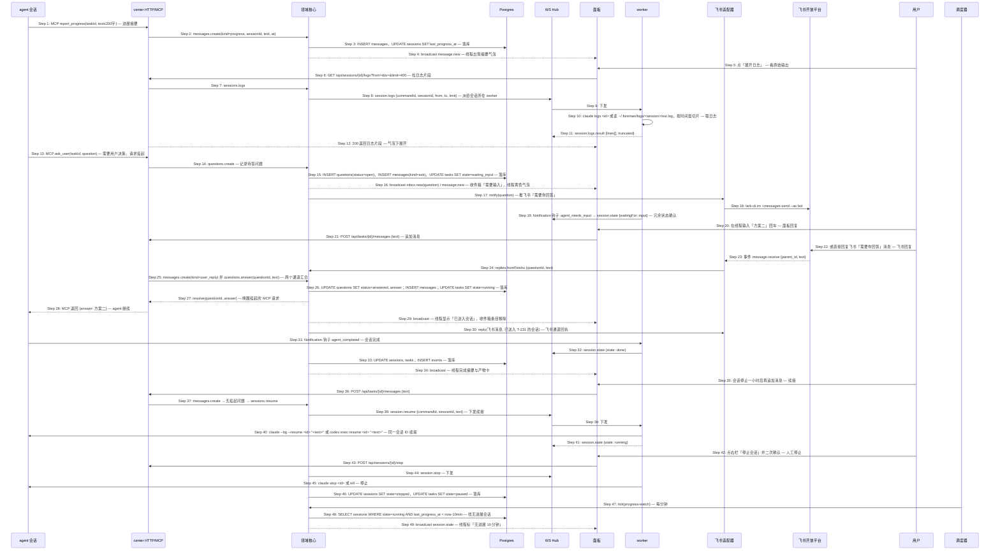

# S07: 跟踪会话进展并在线程中介入 — 时序图

> 来源：Phase 1 S07；Phase 2 `core-02-panel-design.md#S07`、`core-04-conversation-design.md#S07`
> 优先级：P0（M1）
> 触发：某个任务的 agent 会话运行中，或会话需要输入

## 参与方

| 别名 | 组件 |
|------|------|
| AG | agent CLI（任务会话） |
| API | center HTTP（REST + MCP） |
| CORE | center 领域核心 |
| DB | Postgres |
| HUB | center WebSocket Hub |
| P | 面板 SPA |
| WK | worker（会话所在 runtime） |
| FS | center 飞书适配器 |
| FA | 飞书开放平台 |
| U | 用户 |
| SCH | center 调度器 |

## 时序图

## 步骤说明

### 进展与日志

1. **agent** 每完成一个可感知步骤调用 `report_progress`，摘要不超过 200 字（超出由 API 截断并标记）。
2. **center HTTP** 交给领域核心。
3. **领域核心**写消息并刷新会话的最后进展时间。
4. **面板**线程按时间追加摘要气泡，带 agent 标识与"展开日志"。
5. **用户**点展开。
6. **面板**按该摘要的时间窗请求日志。
7. **center HTTP** 交给领域核心。
8. **领域核心**把请求派给会话所在 runtime 的 worker（日志正文不入库，留在 worker 本地）。runtime 离线 → 见 EX-8.1。
9. **WS Hub** 下发。
10. **worker** 取日志：Claude 用 `claude logs <id>`，Codex 读 worker 落盘的输出文件；按时间窗切片，最多 400 行。
11. **worker** 返回片段与是否截断。
12. **面板**在气泡下展开日志面板，末行"查看完整日志"跳全屏日志页（分页调用同一接口）。

### 需要输入与回复

13. **agent** 需要用户决策时调用 `ask_user`，MCP 请求挂起，最长 30 分钟。超时 → 见 EX-13.1。
14. **center HTTP** 交给领域核心。
15. **领域核心**记录问题，任务置为 `waiting_input`。
16. **面板**收件箱出现"需要输入"条目，线程出现黄色气泡，输入框 placeholder 变为"回复 codex 的问题…"。
17. **领域核心**推飞书"需要你回答"。
18. **飞书适配器**发送。
19. **worker** 同时通过 Claude 的 Notification 钩子上报 `agent_needs_input`，用于没有走 MCP 的情况（agent 直接在输出里提问）→ 见 EX-19.1。
20. **用户**在线程回复。
21. **面板**提交为任务消息。
22. **用户**或者在飞书直接回复那条消息。回复了不该回复的消息 → 见 EX-22.1。
23. **飞书**推消息事件，带 `parent_id`。
24. **飞书适配器**按 `parent_id` 找到对应问题。
25. **center HTTP** 两个通道汇合到同一处理：写用户消息，回答问题。问题已被另一通道回答 → 见 EX-25.1。
26. **领域核心**落库并把任务置回 `running`。
27. **领域核心**唤醒挂起的 MCP 请求。
28. **center HTTP** 把答案返回给 agent，会话继续。
29. **面板**显示"已送入会话"，收件箱条目移除，右栏状态回到运行中。
30. **领域核心**在飞书回执。

### 完成、续接与停止

31. **agent** 会话结束，Notification 钩子 `agent_completed` 回调 worker。
32. **worker** 上报终态。失败 → S03 EX-32.1。
33. **领域核心**落库。
34. **面板**线程出现完成摘要与产物卡，右栏显示"已完成（进程将在 1 小时后停止）"。
35. **用户**在会话进程已被 supervisor 停止后追加消息。
36. **面板**提交。
37. **领域核心**判断没有挂起的问题，因此走续接。runtime 离线 → 见 EX-37.1。
38. **领域核心**下发 `session.resume`。
39. **WS Hub** 下发。
40. **worker** 用同一会话 ID 续接：Claude `--bg --resume` 会在原进程已停止时重新拉起并保留上下文；Codex `exec resume`。续接失败 → 见 EX-40.1。
41. **worker** 上报运行中；线程显示"已恢复会话"。
42. **用户**手动停止会话。
43. **面板**提交。
44. **领域核心**下发停止。
45. **worker** 停止进程。
46. **领域核心**会话 `stopped`，任务 `paused`；worktree 保留。
47. **调度器**每分钟检查进展。
48. **领域核心**找出运行中但 10 分钟无进展回写的会话。
49. **面板**线程标"无进展 10 分钟"；30 分钟无进展且 worker 报告进程仍在 → 见 EX-49.1。

## 异常用例

### EX-8.1: runtime 离线，日志不可用

- **触发条件**：Step 8 会话所在 runtime 不在线
- **期望响应**：HTTP 503 `{ code: "RUNTIME_OFFLINE", message: "dev 离线，日志暂不可用" }`；面板日志面板显示该提示并保留"重试"
- **副作用**：无

### EX-13.1: 等待回答超时

- **触发条件**：Step 13 挂起 30 分钟无回复
- **期望响应**：MCP 返回 `{answered: false, reason: "timeout"}`；agent 应记录问题并结束或选择保守路径；问题记录保持 `open`，任务保持 `waiting_input`；之后用户回复走 Step 35–41 的续接路径把答案送入
- **副作用**：收件箱条目保留

### EX-19.1: agent 未用 MCP 提问

- **触发条件**：Step 19 钩子报告 `agent_needs_input` 但没有对应的 `ask_user` 问题
- **期望响应**：领域核心用会话最近日志片段生成一条"需要输入（来自会话输出）"的问题，流程同 Step 15–18；用户回复时因无挂起 MCP 请求，直接走 `session.resume`
- **副作用**：无

### EX-22.1: 回复了非"需要你回答"的飞书消息

- **触发条件**：Step 23 的 `parent_id` 对应的是审批或待拍板消息
- **期望响应**：飞书回帖"该消息用 ✅/❌ 操作，修改请到面板：<链接>"；不执行
- **副作用**：无

### EX-25.1: 问题已被另一通道回答

- **触发条件**：Step 25 时问题状态已 `answered`
- **期望响应**：面板 HTTP 409 `{ code: "QUESTION_ALREADY_ANSWERED" }`，或飞书回帖"已于 hh:mm 在面板回复"；第二条回复仍作为普通用户消息追加到线程并以 `session.resume` 送入会话（用户可能是在补充）
- **副作用**：无

### EX-37.1: runtime 离线时追加消息

- **触发条件**：Step 37 会话所在 runtime 离线
- **期望响应**：消息落库并标记 `pending_delivery`，线程气泡带"排队"标记，输入框上方灰条"dev 离线，消息将在上线后送入"；不会在其他机器新开会话
- **副作用**：runtime 上线后（S05 Step 13）按顺序送入

### EX-40.1: 续接失败

- **触发条件**：Step 40 `--bg --resume` 报会话不存在（本地记录被清理）或非零退出
- **期望响应**：worker 回 `session.error {code: "RESUME_FAILED"}`；领域核心提示"原会话无法恢复"，收件箱出现"以新会话继续（带线程摘要作为上下文）/ 放弃"
- **副作用**：新会话复用 worktree

### EX-49.1: 长时间无进展

- **触发条件**：Step 48 连续 30 分钟无进展且进程仍在
- **期望响应**：线程标红"无进展 30 分钟"，推飞书一次；收件箱出现"查看日志 / 停止会话"条目；不自动停止
- **副作用**：无
